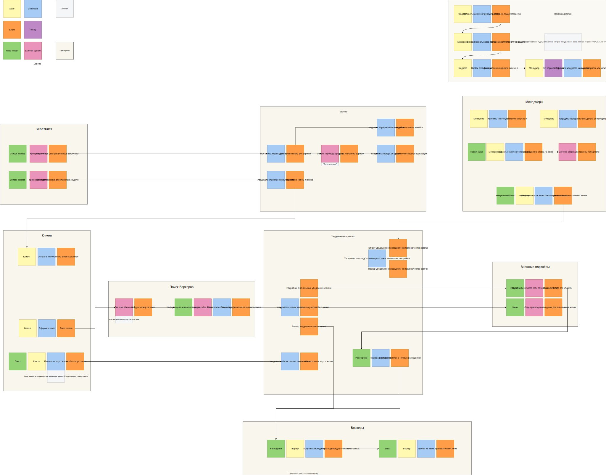

# Решение: Домашка №1

## Event Storming

Получилась такая диаграмма

Группировка по доменам: по возможности, во главе стоит конкретный объект типа Клиент,
Воркер, Менеджер, Партнёры, или Scheduler,
а в остальных случаях группировка по функционалу - уведомления, платежи, найм.

Ниже опишу, почему всё разделил именно на такие запчасти.
Не буду углубляться в Воркеров, Клиентов, Менеджеров, Scheduler, и Внешних Партнёров,
потому что эти пункты достаточно self-explanatory - именно эти объекты что-то делают в своей области.

### Уведомления

Система основывается на уведомлениях - всем приходит уведомление о заказе от клиента,
воркеру приходит уведомление о готовности инвентаря, и так далее.
Именно поэтому отдельным компонентом системы является блок с уведомлениями.

В подсистеме отсутствует прямой актор - это означает, что действия выполняются автоматикой.

У такого подхода есть неприятный сайд-эффект - мы хоть и избежали прямой связности между клиентом и воркером,
но пришли к тому, что теперь немного сложнее отследить процесс.

### Платежи

Это по функционалу больше напоминает подсистему с уведомлениями,
но здесь конкретно происходит работа с уведомлениями о платежах.

Возможно не самое удачное решение, поскольку здесь также задействована
"Золотая шляпа" ака внешний сервис, через который платим воркерам,
но именно из-за этого такое разделение.

### Поиск воркеров

Совмещает в себе матчинг и рассчёт стоимости за конкретного воркера.

Поскольку обе запчасти этой подсистемы представляют из себя загадку (нет конкретных требований),
мы помечаем и матчинг, и рассчёт стоимости как внешние системы.

С рассчётом стоимости есть немного конкретики - например,
учитываются характеристики воркера и "лояльность" клиента,
выражающая в том, сколько денег он слил на заказы.
Именно поэтому здесь указаны Read Models.

### Найм кандидатов

Хоть в здесь и задействованы менеджеры из соседнего квадратика,
эта система немного выбивается из общей картины.

Да, требование [US-100] упоминает "пул воркеров", в который попадёт кандидат,
но по сути всю эту систему с уведомлениями и тестированиями можно спрятать за одной External System
и назвать её, например, "Recruiting" или "Registration" если совсем с названиями лень будет.

~~Мне было жалко её убирать, потому что я с неё начал~~
