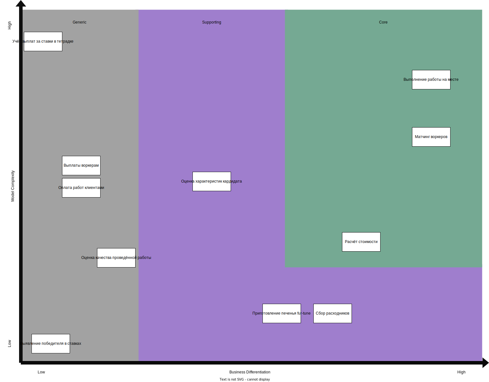

# Решение: Домашка №2

Уже во время работы над первой домашкой было такое чувство,
что разделять на домены по акторам - не всегда удачная затея.
Будем пытаться разгребать (ну вот опять ну что ж такое-то а).

## Домены и поддомены

Можно выделить следующие домены по большим процессам.
Домены же разбиты на меньшие задачи, которые они решают.

- **Найм воркеров**
  - **Оценка характеристик кандидата**
- **Работа с расходниками**
  - **Приготовление печенья fur-tune** - сторонний подрядчик, поэтому отдельно
  - **Сбор расходников**
- **Заказы**
  - **Матчинг воркеров** - загадочная система без описания
  - **Расчёт стоимости** - тоже загадка
  - **Выполнение работы на месте** - не загадка
- **Контроль качества**
  - **Оценка качества проведённой работы**
- **Ставки**
  - **Выявление победителя в ставках**
  - **Учёт выплат за ставки в тетрадке**
- **Биллинг**
  - **Оплата работ клиентами**
  - **Выплаты воркерам**

Дополнительно можно было бы выделить систему с кучей уведомлений, но звучит как оверкилл.
Проще будет вынести уведомления по своим системам.

## Core Domain chart

Разделим поддомены на три группы

Рассказываю логику почему именно так. Начнём с Core domain.

- Система матчинга на данный момент звучит как нечто неизвестное, но очень важное.
  Потенциально может стать самой крутой фичей.
- Работа на месте выполняется самыми крутыми воркерами,
  поэтому кажется самым важным и сложным пунктом.
  Может и не совсем точно на графике,
  но поскольку бизнес крутится вокруг этой задачи,
  этот поддомен сразу идёт в Core.
- Расчёт стоимости тоже представляет из себя что-то неведомое сейчас,
  скорее всего будет зависеть от результатов матчинга.
  Её можно сделать слишком хорошо, и тогда она будет частью уникальности бизнеса,
  а можно сделать очень скучно, и тогда она по факту перейдёт в Supporting поддомен.

Supporting:

- Взаимодействие со сторонними подрядчиками и складом настроить безусловно нужно,
  это не является непосильной задачей.
  Ушло так сильно вправо, потому что котаны со склада "сами собирают заказы на свой вкус",
  а печеньки прикольно и необычно.
- Оценка характеристик кандидата хоть и является относительно сложной задачей
  (хотим отобрать бездельников который попадают в 3% лучших), само же тестирование,
  судя по требованиям, не представляет из-себя что-то нестандартное,
  но и не является полностью заменяемой фичей из-за этих 3%.

Generic - тут вообще скукота полнейшая:

- Контроль качества - "Ваше мнение очень важно для нас".
- Система выплат особо ничем не отличает бизнес от других.
- Со ставками ситуация аналогична выплатам - никак не определяет бизнес,
  но очень-очень нужно.
- Я не знаю как автоматизировать бумажку с ручкой (тетрадку с учётом), поэтому гига-сложно.

## Bounded Contexts

Получаем следующие контексты, сгруппированные по поддоменам.
Цвета совпадают с диаграммой из прошлого пункта.

Выглядит слишком идеально? Как будто да.

Альтернативные точки зрения:

- Объединить сбор расходников и подрядчика с печеньками.
  Оба контекста по сути работают в домене склада, но к ним будет немного разный подход.
  А ещё сборщики как будто главнее.
- Объединить систему ставок и учёт выплат победителям в один поддомен.
  Это всё относится к ставкам, но мне показалось, что лучше разделить, потому что
  тетрадка и система выявления победителей указаны в разных требованиях.
- Сделать один Core поддомен - работа с заказами,
  а он бы уже в себя включал матчинг, расчёт стоимости, и саму работу.
  Звучит как небольшой перегруз, потому что правило 1 поддомен == 1 bounded context
  вполне позволяет разбить систему именно так.
- Всю работу с платёжными системами (клиенты и воркеры, но не серые платежи)
  можно объединить в одной системе и назвать "платёжные операции".
  Решил всё же разделить, потому что там разные способы расчёта сумм стоимостей и выплат.
