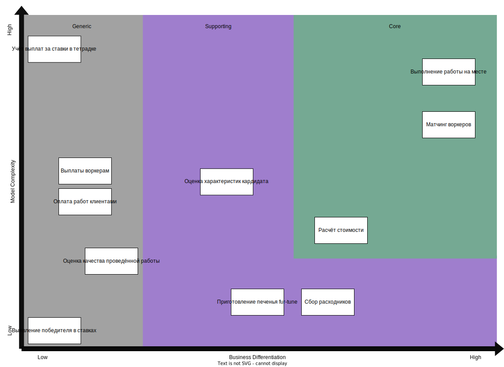
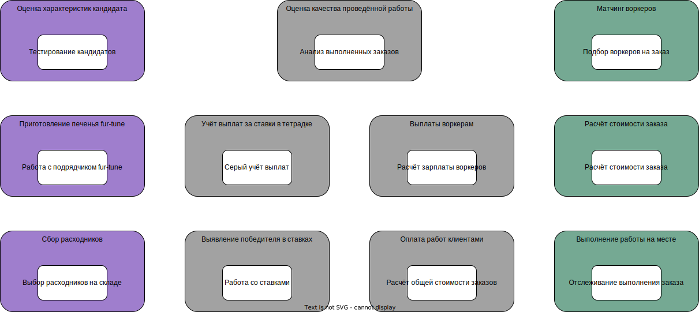

# Решение: Домашка №2

Уже во время работы над первой домашкой было такое чувство,
что разделять на домены по акторам - не всегда удачная затея.
Будем пытаться разгребать (ну вот опять ну что ж такое-то а).

## Домены и поддомены

Можно выделить следующие домены по большим процессам.
Домены же разбиты на меньшие задачи, которые они решают.

- **Найм воркеров**
  - **Оценка характеристик кандидата**
- **Работа с расходниками**
  - **Приготовление печенья fur-tune** - сторонний подрядчик, поэтому отдельно
  - **Сбор расходников**
- **Заказы**
  - **Матчинг воркеров** - загадочная система без описания
  - **Расчёт стоимости** - тоже загадка
  - **Выполнение работы на месте** - не загадка
- **Контроль качества**
  - **Оценка качества проведённой работы**
- **Ставки**
  - **Выявление победителя в ставках**
  - **Учёт выплат за ставки в тетрадке**
- **Биллинг**
  - **Оплата работ клиентами**
  - **Выплаты воркерам**

Дополнительно можно было бы выделить систему с кучей уведомлений, но звучит как оверкилл.
Проще будет вынести уведомления по своим системам.

## Core Domain chart

Разделим поддомены на три группы

Рассказываю логику почему именно так. Начнём с Core domain.

- Система матчинга на данный момент звучит как нечто неизвестное, но очень важное.
  Потенциально может стать самой крутой фичей.
- Работа на месте выполняется самыми крутыми воркерами,
  поэтому кажется самым важным и сложным пунктом.
  Может и не совсем точно на графике,
  но поскольку бизнес крутится вокруг этой задачи,
  этот поддомен сразу идёт в Core.
- Расчёт стоимости тоже представляет из себя что-то неведомое сейчас,
  скорее всего будет зависеть от результатов матчинга.
  Её можно сделать слишком хорошо, и тогда она будет частью уникальности бизнеса,
  а можно сделать очень скучно, и тогда она по факту перейдёт в Supporting поддомен.

Supporting:

- Взаимодействие со сторонними подрядчиками и складом настроить безусловно нужно,
  это не является непосильной задачей.
  Ушло так сильно вправо, потому что котаны со склада "сами собирают заказы на свой вкус",
  а печеньки прикольно и необычно.
- Оценка характеристик кандидата хоть и является относительно сложной задачей
  (хотим отобрать бездельников который попадают в 3% лучших), само же тестирование,
  судя по требованиям, не представляет из-себя что-то нестандартное,
  но и не является полностью заменяемой фичей из-за этих 3%.

Generic - тут вообще скукота полнейшая:

- Контроль качества - "Ваше мнение очень важно для нас".
- Система выплат особо ничем не отличает бизнес от других.
- Со ставками ситуация аналогична выплатам - никак не определяет бизнес,
  но очень-очень нужно.
- Я не знаю как автоматизировать бумажку с ручкой (тетрадку с учётом), поэтому гига-сложно.

## Bounded Contexts

Получаем следующие контексты, сгруппированные по поддоменам.
Цвета совпадают с диаграммой из прошлого пункта.

Выглядит слишком идеально? Как будто да.

Альтернативные точки зрения:

- Объединить сбор расходников и подрядчика с печеньками.
  Оба контекста по сути работают в домене склада, но к ним будет немного разный подход.
  А ещё сборщики как будто главнее.
- Объединить систему ставок и учёт выплат победителям в один поддомен.
  Это всё относится к ставкам, но мне показалось, что лучше разделить, потому что
  тетрадка и система выявления победителей указаны в разных требованиях.
- Сделать один Core поддомен - работа с заказами,
  а он бы уже в себя включал матчинг, расчёт стоимости, и саму работу.
  Звучит как небольшой перегруз, потому что правило 1 поддомен == 1 bounded context
  вполне позволяет разбить систему именно так.
- Всю работу с платёжными системами (клиенты и воркеры, но не серые платежи)
  можно объединить в одной системе и назвать "платёжные операции".
  Решил всё же разделить, потому что там разные способы расчёта сумм стоимостей и выплат.

## Характеристики системы

### Availability

К разным подсистемам есть разные требования.

Например, в поддомене, ответственный за найм, требуется высокая Availability,
потому что ожидаются дудос-атаки от конкурентов.

С другой стороны, не для всех подсистемам высокая Availability - это настолько важное требование. Например, система ставок не является слишком часто используемым компонентом.

Также, общая нагрузка на систему (не считая найма) ожидается сравнительно низкая, поэтому приоритет Availability не самый высокий.

### Scalability

Высокая нагрузка ожидается только на один компонент системы.

### Modifiability

Из общих требований: нужно обеспечить высокую Modifiability
для поддомена с тестированием новых кандидатов - будут
часто тестироваться новые гипотезы.

Логично предположить, что система матчинга (которая на данный момент не описана)
будет часто изменяться, поскольку это Core поддомен.
Таким образом, этому компоненту также требуется высокий Modifiability.

Более того, требование к низкому Time To Market говорит о желании иметь
высокую Modifiability.

С другой стороны, есть система ставок, в которую "добавлять что-то новое в коде никто не хочет" (но она, можно сказать, изолирована от остальной системы)

### Maintainability

Прямое требование: высокая надёжность системы при тестировании новых гитотез отсева.

В системе есть компоненты, которые не имеют прямой связи друг между другом:
найм новых воркером, выполнение заказов, система ставок.
Предполагается, что изменение в одной системе не ломает другую,
тем самым обеспечивая Maintainability.
Аналогично с системой матчинга и рассчёта стоимости - изменения в одной подсистеме не должны ломать другую систему.

### Security

Требования к системе требуют достаточно высокий уровень безопасности. Например:

- "Статусы задачи может менять только клиент" - нужно, чтобы воркеры не чизили работу.
- "Типы услуги задаются в админке менеджерами" - чтобы клиенты не писали ерунду в заказе.

Хоть никто этого не упоминал, но также подразумеваются стандартные меры безопасности.

### Performance

Нет высоких требований к производительности основной системы.
Высокое требование к производительности системы найма напрямую берётся из
требования к её Availability.

Единственное требование к Performance, упомянувшее время - требование
про приготовление печенек. Прикольно, но не слишком критично.

Другой вид Performance - качество тестирования кандидатов
(нужно, чтобы коты попадали в 3% лучших) - уже намного важнее.

### Agility

Требуется высокий показатель Agility в связи с планами тестировать
различные гипотезы для отсева кандидатов.

Agility применимо к системе матчинга, если следовать из Modifiability.

### Testability

Напрямую не упоминается, но следует из требования к надёжности
системы при проверке новых гипотез отсева кандидатов - нужно
иметь возможность проверить, что новая система работает.

### Deployability

Напрямую следует из низкого Time To Market. Это нам надо.

### Usability

Нет явных требований высокой Usability.
Можно ожидать приемлемый уровень Usability исходя из требований:

- Менеджеры задают тип услуги
- Клиенты меняют статус заказа
- Всем приходят уведомления

### Consistency

Нет высоких требований к Consistency, помимо типов услуги и статусов заказа.

- Воркеров можно добавить когда угодно.
- Выплаты пересчитываются раз в месяц.
- В тетрадку главного менеджера долго записывать,
  кто кому сколько денег перевёл после победы на ставках.

### Simplicity

Вообще нет требований по этой теме (может я упустил).

А вообще, сама система даже по требованиям не представляет из себя rocket science,
поэтому низкий показатель Simplicity на выходе будет позором.

## Выбор архитектурного стиля

В прошлый раз выбрали путь к победе через группировку монолит.
В этот раз ~~для разнообразия~~ выбор между service-based и микросервисами.
Побеждают в этой борьбе микросервисы по следующим причинам:

- Микросервисы умеют в высокую Scalability, что повышает Availability.
- Нам нужны разные требования для разных частей системы - найм
  кандидатов требует высокий Availability и Modifiability.
  Другой сервис - матчинг - может требовать только Modifiability.
- Не все части системы будут часто меняться, и
  деплоить заново всю систему при малейших изменениях не слишком удобно и надёжно
  с учётом требования про низкий Time To Market.
- Высокий Maintainability: по аналогии с деплоями,
  только уже про восстановление от ошибок.
  Да, нужно ещё понять, какой именно сервис упал,
  но зато остальные сервисы в это время будут живы.
