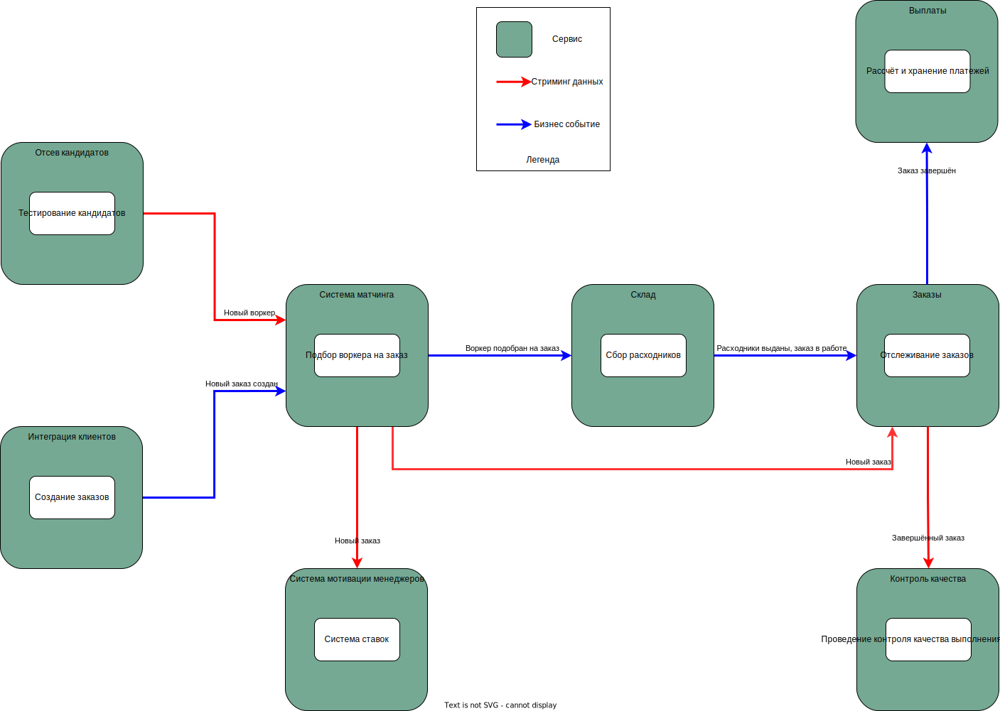

# Решение: Домашка №3

## Стейкхолдеры

Выделим таких держателей стейков с их консёрнами:

- **Топ-менеджмент** - родительская компания
  - Тестирование большего количества гипотез по отсеву потенциальных работников.
    Планируется продавать это решение другим (сильно возросла сложность).
    Требуется релизный цикл в неделю как максимум.
  - Для остальной системы хотят релизный цикл в 1 месяц.
- **Разработчики**
  - Стабильная система, которую легко фиксить в случае сбоев.
- **Клиенты**
  - Ожидаемое поведение системы.
- **Воркеры** [new]
  - Ожидаемое поведение системы, в том числе своевременные уведомления о заказах.
    (На месте воркера, не хотелось бы напороться на штраф когда
    не успел на заказ из-за хреновых уведомлений).
- **Менеджеры**
  - Скрыть систему ставок от посторонних глаз типа всех остальных отделов
    и разработчиков, которые системой не занимаются.
  - Рост нагрузки с 10 заказов в день до 10 заказов в минуту.
- **Работники склада** - сборщики расходников [new]
  - Ожидаемое поведение системы.
- **Админы**
  - Простота мониторинга системы.
- **Юристы**
  - Соблюдение правовых норм.
- **Финотдел**
  - Списание денег с клиентов не раз в неделю, а раз в месяц.
    Выплаты воркерам раз в месяц.
  - Надежность хранения финансовой информации.
  - Внедрение новых способов списания денег для клиентов.

Раскидаем стейкхолдеров по матрице Влияние-Интерес:

| Стейкхолдер      | Влияние | Интерес |       Приоритет и группа        |
|:---------------- |:-------:|:-------:|:-------------------------------:|
| Топ-менеджмент   | Высоко  | Высоко  |       1 - Плотная работа        |
| Разработчики     | Высоко  | Высоко  |       1 - Плотная работа        |
| Админы           | Высоко  |  Низко  | 2 - Удовлетворение потребностей |
| Клиенты          |  Низко  | Высоко  |       3 - Информирование        |
| Воркеры          |  Низко  | Высоко  |       3 - Информирование        |
| Менеджеры        |  Низко  | Высоко  |       3 - Информирование        |
| Работники склада |  Низко  |  Низко  |         4 - Мониторинг          |
| Юристы           |  Низко  |  Низко  |         4 - Мониторинг          |
| Финотдел         |  Низко  |  Низко  |         4 - Мониторинг          |

Визуализируем важность консёрнов стейкхолдеров

## Переделываем структуру системы

В прошлый раз получилось сильно много циклических зависимостей
(то есть больше нуля).
Исправимся, попробуем сделать что-нибудь получше, например так.

Рассказываю логику вкратце:

- Ставки мы должны спрятать от всех, и ими мало кто будет заниматься,
  поэтому это generic.
- Отслеживание заказов, интеграция клиентов -
  всё это вообще не представляет чего-то особо уникального,
  проще взять готовое решение.
- Складские работники у нас с приколом, и ещё есть печеньки.
  Скорее про уникальность, чем про сложность, поэтому supporting.
  Если бы не такие особенности, это бы стало generic поддоменом
  слилось бы с поддоменом заказов
  (но так и осталось бы отдельным контекстом).
- Выплаты по аналогии не отличаются ничем удивительным,
  но нам желательно удовлетворить хотелку финотдела с безопасностью.
  В таких случаях можно что-нибудь колхозить самим, но это может быть не самым удачным решением, и возможно проще взять что-то готовое.
- Контроль качества выполнения заказов - не отличительная черта бизнеса,
  хоть и достаточно важная и сложная задача.
  Может не хватить простого "оцените работу по шкале от 1 до 5",
  И воркеры у нас самые крутые, поэтому supporting. Возможно, переоценено.
- Система матчинга у нас супер мега инновационная, поэтому core.
  Будем её всяко-разно менять.
- По аналогии - тестируем много гипотез по отсеву кандидатов
  и часто меняем этот кусок, поэтому тоже core.

С такой структурой проще удовлетворять требования
и соответствовать желаемым характеристикам.

## Архитектурный стиль

Описанная система уже разбита на независимые модули,
которые связывают данные и temporal coupling.

Из-за разных требований к разным запчастям системы,
самым надёжным решением будет строить распределённую архитектуру,
где каждый поддомен реализован как отдельный сервис со своим стилем.

Выделять их стоит в отдельные сервисы,
потому что каждый из них решает отдельную задачу.

Рассмотрим стили каждого сервиса.

### Все Generic поддомены

Сюда входят:

- Интеграция клиентов
- Система Мотивации Менеджеров
- Заказы

Каждый из этих поддоменов можно реализовать как самый обычный микросервис,
поскольку высоких ожиданий и жёстких требований к этим частям нет,
но нужно быть готовыми к росту в будущем.

Из-за требований к scalability, а также из-за отсутствия строгой структуры данных
в каждом из сервисов можно выбрать документо-ориентированную базу данных.

### Склад

На складе работники собираются сборкой расходников, а расходники делятся
на два типа: обычные (наши), и печеньки (не наши).

Здесь выбор встаёт между модульным монолитом или service-based структурой,
потому что для одного склада одна база данных звучит логично.

Поскольку у нас нет огромного списка подрядчиков
с разными способами взаимодействия, выбор падает
на модульный монолит из-за простоты реализации.

Трудно определить чёткую структуру данных,
поэтому подойдёт документо-ориентированная БД.

### Контроль Качества

Мы должны быть готовыми к росту компании и количеству заказов,
поэтому бахнем микросервисом.

Выбор БД не имеет значения, поэтому документо-ориентированная БД
подходит из соображений баланса сложности.

### Выплаты

Микросервис с особым требованием от финотдела -
безопасное и надёжное хранение информации о платежах.

Напрашивается реляционная БД из-за требований к консистентности,
следующему из надёжности хранения структурированных данных.

### Отсев кандидатов

Одна из двух самых часто меняющихся частей системы.
Выделим важные требования для этого сервиса:

- Безопасность и availability - устойчивость в ддос атакам.
- Scalability - reliability via redundancy как способ противостоять дудосу.
- Modifiability, deployability - хотим очень низкий time to market,
  и будем часто тестировать новые гипотезы.

Напрашивается микросервис, который можно легко и быстро скейлить.

Документо-ориентированная БД подходит больше всего,
потому что трудно определить конкретную структуру данных,
учитывая частые изменения в системе, множество характеристики кандидатов,
и требование к scalability.

### Система матчинга

Новые требования к системе матчинга просто кричат о том,
что нужен [ПАЙПЛАЙН](https://youtu.be/UkSiywrWG3A?t=56) - мы хотим
свободно менять последовательность каких-то заранее известных шагов.

Отдельно отмечаем требования к modifiability и низкому TTM -
пайплайн в это умеет и могёт (просто красавчик обожаю).

Из-за высокой изменяемости системы, а также из-за отсутствия строгой структуры данных,
выбираем документо-ориентированную БД.

## Коммуникации

Диаграмма коммуникаций

Ни для одного сервиса нет нужны синхронно ждать
завершения работы другого через простой request-response.

В основном "пайплайне" от создания заказа до выполнения и оплаты
мы асинхронно реагируем на события.
Ожидается, что события уже описывают все нужные данные для работы.

Остальные же коммуникации представляют из себя асинхронный стриминг данных.

- Появление новых воркеров в пуле
- Создание нового заказа - можно делать ставки.
- В контроль качества попадают только завершённые заказы.

## Фитнес-функции

> Фитнес? Функции? Это че функциональные тренировки?

Основная забота о core поддоменах требует выделить
отдельные финтес-фукции для этих компонентов системы - им
надо уделить особое внимание.
Все остальные компоненты можно грести под одну гребёнку и
выделить общие для всех фитнес функции.

**Система матчинга:**

- Проверка реализации архитектурного стиля.
- Анализ coupling и cohesion.

**Тестирование кандидатов:**

- Нагрузочные тесты scalability.
- Проверка периодичности релиза не реже чем раз в неделю.

**Вся системы в общем:**

- Покрытие тестами выше 80% (а конкретно выше 90%)
- Проверка периодичности релиза не реже чем раз в 2 недели.
- Контрактное тестирование событий через schema-registry.

## Architectural decision records (ADR)

Для красоты сделал в отдельном файле, потому что
на деле ADR будет отдельной папочкой с MD файлами.
(Нууууу у нас так по крайней мере, но эти ADR некому писать - уже
полгода там только `.gitkeep` в папочке лежит) 

НИ В КОЕМ СЛУЧАЕ не смотреть здесь: [ADR-001 - Изоляция системы матчинга](./ADR-001%20-%20Изоляция%20системы%20матчинга.md)
