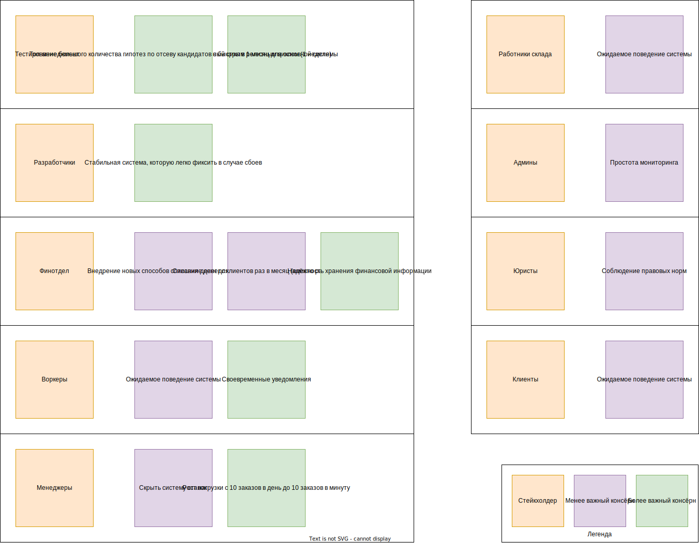
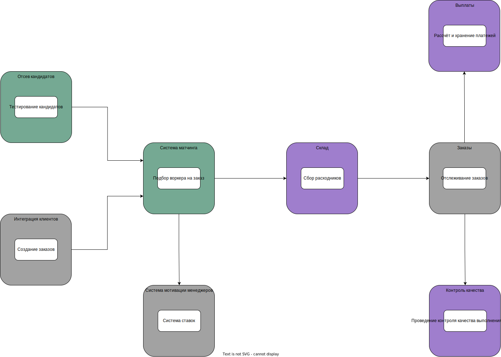

# Решение: Домашка №3

## Стейкхолдеры

Выделим таких держателей стейков с их консёрнами:

- **Топ-менеджмент** - родительская компания
  - Тестирование большего количества гипотез по отсеву потенциальных работников.
    Планируется продавать это решение другим (сильно возросла сложность).
    Требуется релизный цикл в неделю как максимум.
  - Для остальной системы хотят релизный цикл в 1 месяц.
- **Разработчики**
  - Стабильная система, которую легко фиксить в случае сбоев.
- **Клиенты**
  - Ожидаемое поведение системы.
- **Воркеры** [new]
  - Ожидаемое поведение системы, в том числе своевременные уведомления о заказах.
    (На месте воркера, не хотелось бы напороться на штраф когда
    не успел на заказ из-за хреновых уведомлений).
- **Менеджеры**
  - Скрыть систему ставок от посторонних глаз типа всех остальных отделов
    и разработчиков, которые системой не занимаются.
  - Рост нагрузки с 10 заказов в день до 10 заказов в минуту.
- **Работники склада** - сборщики расходников [new]
  - Ожидаемое поведение системы.
- **Админы**
  - Простота мониторинга системы.
- **Юристы**
  - Соблюдение правовых норм.
- **Финотдел**
  - Списание денег с клиентов не раз в неделю, а раз в месяц.
    Выплаты воркерам раз в месяц.
  - Надежность хранения финансовой информации.
  - Внедрение новых способов списания денег для клиентов.

Раскидаем стейкхолдеров по матрице Влияние-Интерес:

| Стейкхолдер      | Влияние | Интерес |       Приоритет и группа        |
|:---------------- |:-------:|:-------:|:-------------------------------:|
| Топ-менеджмент   | Высоко  | Высоко  |       1 - Плотная работа        |
| Разработчики     | Высоко  | Высоко  |       1 - Плотная работа        |
| Админы           | Высоко  |  Низко  | 2 - Удовлетворение потребностей |
| Клиенты          |  Низко  | Высоко  |       3 - Информирование        |
| Воркеры          |  Низко  | Высоко  |       3 - Информирование        |
| Менеджеры        |  Низко  | Высоко  |       3 - Информирование        |
| Работники склада |  Низко  |  Низко  |         4 - Мониторинг          |
| Юристы           |  Низко  |  Низко  |         4 - Мониторинг          |
| Финотдел         |  Низко  |  Низко  |         4 - Мониторинг          |

Визуализируем важность консёрнов стейкхолдеров

## Переделываем структуру системы

В прошлый раз получилось сильно много циклических зависимостей
(то есть больше нуля).
Исправимся, попробуем сделать что-нибудь получше, например так.

Рассказываю логику вкратце:

- Ставки мы должны спрятать от всех, и ими мало кто будет заниматься,
  поэтому это generic.
- Уведомления, отслеживание заказов, интеграция клиентов -
  всё это вообще не представляет чего-то особо уникального,
  проще взять готовое решение.
- Складские работники у нас с приколом, и ещё есть печеньки.
  Скорее про уникальность, чем про сложность, поэтому supporting.
  Если бы не такие особенности, это бы стало generic поддоменом
  слилось бы с поддоменом заказов
  (но так и осталось бы отдельным контекстом).
- Выплаты по аналогии не отличаются ничем удивительным,
  но нам желательно удовлетворить хотелку финотдела с безопасностью.
  В таких случаях можно что-нибудь колхозить самим, но это может быть не самым удачным решением, и возможно проще взять что-то готовое.
- Контроль качества выполнения заказов - не отличительная черта бизнеса,
  хоть и достаточно важная и сложная задача.
  Может не хватить простого "оцените работу по шкале от 1 до 5",
  И воркеры у нас самые крутые, поэтому supporting. Возможно, переоценено.
- Система матчинга у нас супер мега инновационная, поэтому core.
  Тем более, что будем продавать её и всяко-разно менять
- По аналогии - тестируем много гипотез по отсеву кандидатов
  и часто меняем этот кусок, поэтому тоже core.

С такой структурой проще удовлетворять требования
и соответствовать желаемым характеристикам.
