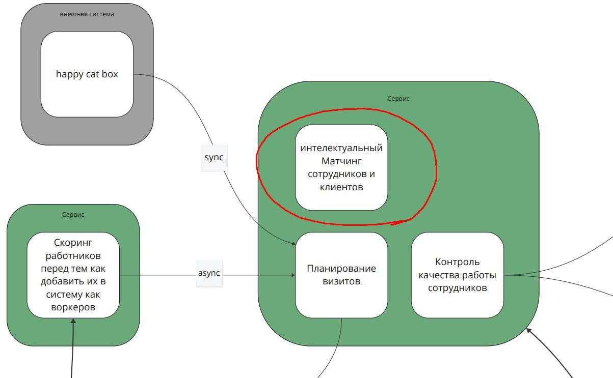
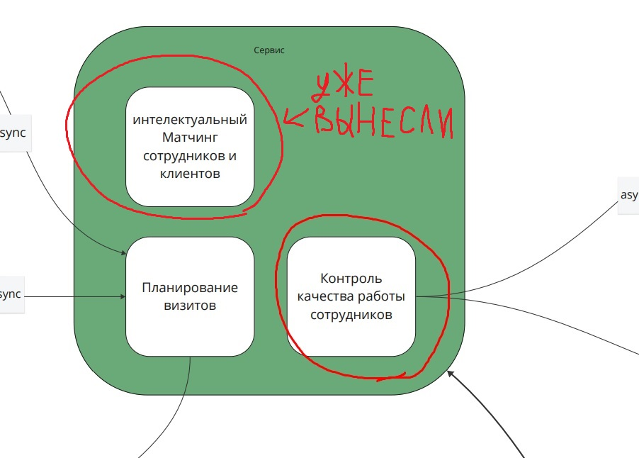
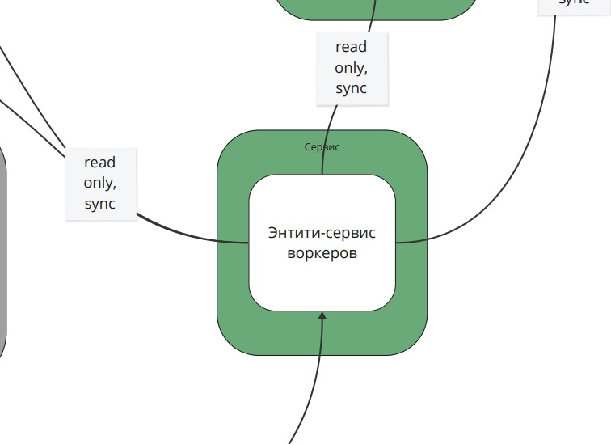
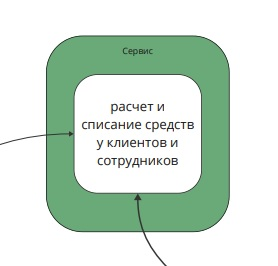
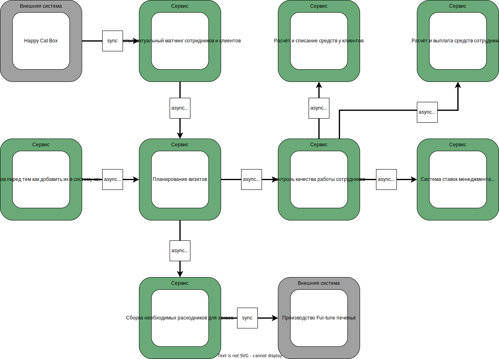

# Решение: Домашка №4

Выбрал предложенный вариант.
Исходное состояние системы можно глянуть [здесь](./materials/monolith_before.pdf)

## Выделяем проблемные места

### Интеллектуальный матчинг

В исходной системе матчинг является частью сервиса, ответственного за заказы.

Решение звучит логично, но в таком случае будет сложно соответствовать требованиям.

- Требуется высокий modifiability и низкий TTM,
  а также scalability и deployability в связи с ростом количества заказов.
- ~~Судя по диаграмме, компонент ни с чем не связан~~

Напрашивается выделить этот компонент в отдельный сервис,
у которого будет свой стиль - пайплайн
(исходит из требований к системе - изменяемая
последовательность заранее известных шагов).

Более того, синхронные коммуникации могут привести к высоким задержкам.
Предлагается использовать асинхронные коммуникации.

Instability у сервисов Happy Cat Bot и планирования визитов не изменится.
Для матчинга `Ca = 1`, `Ce = 1`, `Instability = 0.5`.

### Контроль качества

Не менее логичным звучит держать контроль качества работы сотрудников
в поддомене с заказами.

Тем не менее, всё же предлагается разбить этот кусок на запчасти
(подразумеваем, что матчинг уже вынесли в отдельный сервис).

До изменения `Ca = 1`, `Ce = 2`, `Instability = 0.66`.
После изменения циферки не изменятся, но изменится входящая связь - вместо
энтити-сервиса воркеров, стрелка будет идти из планирования визитов.

До изменения есть неявная связь по данным между планированием визитов и
контролем качества работы сотрудников.
После изменения, мы превратим эту связь в явную, но не изменим Instability системы.

### Энтити-сервис воркеров

Поговаривают, что энтити-сервисы - это антипаттерн?
Зависит от ситуации :nerd_emoji:

Здесь нужно понять, насколько полезно было выделять отдельный энтити-сервис.
Для этого посчитаем его instability в исходной системе:

- Входящих связей `Ca=1`
- Исходящих связен `Ce=5`
- `Instability = Ce / (Ca + Ce) = 5 / 6 = 0.8`

Получилось достаточно высокое значение.
Вызвано это высоким количеством связей между компонентами
Исходящие связи (их многовато) идут в следующие системы:

- Скоринг работников (там вообще двухсторонняя стрелка).
- Ставки
- Сборка расходников
- Выплаты
- Весь поддомен заказов (?а куда конкретно?)

Очень хочется уменьшить количество связей,
а также более точно и понятно описать те, что останутся.

Энтити-сервис воркеров - по сути простой CRUD сервис, который что-то хранит.
Хранить это отдельно от того места, где больше всего нужны эти данные,
хоть и звучит круто в плане отказоустойчивости,
но не имеет особого смысла, а также может привести к задержкам при передаче данных,
что может быть критично учитывая рост количества пользователей
(а у нас там ещё синхронные коммуникации, страшно в общем).

Предлагается запихнуть этот энтити-сервис в контекст планирования визитов,
потому что хранимые сущности (воркеры) в основном используются именно там,
и туда же они и попадают через скоринг.

Таким образом, изменится Instability и других частей системы:

- Скоринг: `Ca = 0`, `Ce = 1`, `Instability = 1`,
  (было `Ca = 1`, `Ce = 2`, `Instability = 0.66`).
  Звучит страшно, но если обеспечить контрактное тестирование и
  асинхронные event-driven коммуникации,
  можно будет смириться с высоким показателем Instability и вполне успешно
  поддерживать высокий Modifiability скоринга,
  потому что сервис работы с заказами вряд ли будет меняться очень часто.
- Планирование визитов: `Ca = 2`, `Ce = 2`, `Instability = 0.5`. Приемлемо.
- Ставки и расчёт/списание средств - `Ce = 0`,
  поэтому `Instability = 0` - не поменялось.
- Сборка расходников - `Ca = 1`, `Ce = 1`, `Instability = 0.5`
  (было `Ca = 2`, `Ce = 1`, `Instability = 0.33`).
  Чуть выросло, но всё ещё приемлемо.

> Пока писал прошлую секцию, где-то часа два думал и ругался с чатжпт,
  пытаясь понять, как лучше поступить.
  Всё из-за трейдоффа - рост Instability в Core поддоменах,
  или намного меньше связей во всей системе в целом
  в связи с истреблением нестабильного компонента,
  который ~~в каждой бочке затычка~~ в каждом сервисе используется.
  Чатжпт кстати лохозавр - не смог меня переспорить.
  В итоге я пришёл к тому, что важнее смотреть не просто на циферку Instability,
  а учитывать количество связей с данным компонентом системы,
  поэтому сервис выпиливаем, и будем стримить данные по возможности.

### Финансовые штуки

Сейчас один сервис отвечает за расчёт и платежи сразу и клиентов, и сотрудников.

Всё бы ничего, но есть требование добавлять новые способы оплаты для клиентов.
Более того, хотелось бы иметь некую безопасность,
чтобы клиенты ну вот никак (даже при ошибках косоруких разрабов)
не могли узнать инфу про сотрудников, типа безопасно by design 

Предлагается разбить один сервис на два - отдельно для клиентов и сотрудников.
Стабильность именно этих двух сервисов в циферках такая же,
как и у одного сервиса до разделения, просто лучше соответствие требованиям.

Связанные же сервисы становятся более нестабильными - так,
растёт Instability у контроля качества с 0.66 до 0.75 за счёт +1 к исходящим связям,
хотя с точки зрения сервисов списаний и выплат там как было 1, так и осталось 1.

## Итоговая система

## Как же всё-таки делать эту вашу систему

Никак 💀

Надо рассмотреть две ситуации в команде и решить, какой путь подходит больше.

### Когда есть свободные люди и ресурсы, а опыта и/или инфраструктуры нет

Раз нет опыта, надо начинать с простого и потихоньку учиться.

Предлагается делать в таком порядке

1. Разбиваем расчёт и списание средств клиентов и сотрудников на два сервиса.
    Подразумевается, что раз один сервис, то и база была одна,
    поэтому начать стоит с изоляции баз данных и стриминга данных из других сервисов.
    Напрашивается Change Data Capture.
2. Выпилить контроль качества и запилить отдельный сервис.
    По сложности этот кусок попроще матчинга, поэтому сначала сюда.
    Подойдёт Tactical Forking, потому что
    мы не собираемся менять поведение вотпрямщас.
3. Вынести матчинг в отдельный сервис.
    Требования к Modifiability сервиса матчинга подразумевают
    работу другой команды над сервисом.
    Таким образом, удобнее будет бахнуть Tactical Forking.
4. Взяться за внедрение энтити-сервиса в планирование визитов.
    Звучит как самая сложная часть чисто из-за количества связей.

### Когда свободных людей и ресурсов нет, а опыт и/или инфраструктура есть

Когда мало людей, но они опытные, то стремимся
при малых усилиях получить максимальный эффект от изменений, чтобы куски системы
лучше соответствовали требованиям бизнеса.

1. Выпиливаем матчинг и делаем для этого отдельный сервис.
    Чем быстрее другие ребятки смогут заниматься этим сервисом,
    тем лучше будет удовлетворены Modifiability и низкий TTM.
2. Внедрение энтити-сервиса в планирование визитов.
    Распутаем кучу зависимостей и увеличим отказоустойчивость и scalability.
    Сложно, но очень нужно.
3. Разделить расчёт и списание средств клиентов и сотрудников на два сервиса.
    Хотим удовлетворить хотелки бизнеса про безопасность и новые системы оплаты.
4. Вынести контроль качества в отдельный сервис.
    Самое низкое по приоритету и результативности, поэтому последнее в списке.
